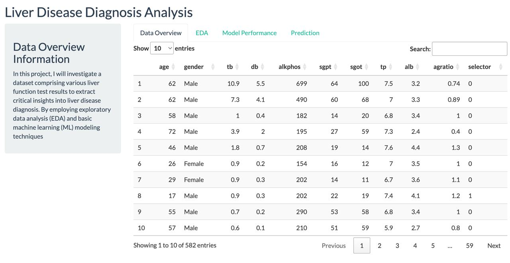

# Abstract

Liver disease is a major global health concern. Early diagnosis is crucial for effective treatment and management. This paper explores the use of machine learning models, specifically Random Forest and K-Nearest Neighbors (KNN), to predict liver disease based on clinical data. The analysis is based on the Indian Liver Patient Dataset (ILPD), which includes demographic details and liver function test results. The project also features the development of an interactive R Shiny application, enhancing the accessibility and understanding of the data analysis and model predictions.

# Introduction

Liver diseases, which affect millions worldwide, often progress silently and rapidly. Early detection and accurate diagnosis are paramount to managing these diseases effectively. This study leverages a dataset consisting of various liver function tests and demographic information to analyze and predict liver disease presence using machine learning techniques. This approach not only aids in understanding the disease dynamics but also contributes to better clinical decision-making.

# Data Exploration

Exploratory Data Analysis (EDA) was performed to understand the dataset better. Key visualizations include:

The density plots for the selected variables show varying distributions: **age**, **alb**, and **tp** exhibit relatively normal distributions, while **db**, **tb**, **alkphos**, **sgpt**, and **sgot** are heavily skewed to the right, indicating a concentration of lower values with fewer high outliers. This suggests potential transformations, such as logarithmic scaling, might be necessary for the skewed variables to improve modeling outcomes.

The boxplot shows that the median Albumin and Globulin Ratio (A/G Ratio) is similar between genders, but males display a wider interquartile range and more outliers, suggesting greater variability in their A/G ratios compared to females.

Multicollinearity can be a possibile threat to our model here. Might need to examine which variables actually matter.

Peaks in liver disease are evident in **individuals in their early 30s and late 50s to early 60s**, suggesting these age groups are at **higher risk**. Males show a **significantly higher count of liver disease** compared to females, indicating that **being male is associated with a higher likelihood** of liver disease.

The plots reveal trends in liver function tests relative to the presence of liver disease:

1. **Total Bilirubin** and **Alkaline Phosphatase**: Both markers display **higher levels associated with disease presence**, indicating their potential as significant indicators of liver disease.

2. **Aspartate Aminotransferase (SGOT)**: Shows elevated levels more frequently in the disease group, with a wide distribution among all patients, highlighting variability but a general trend towards **higher levels in affected individuals**.

3. **Albumin and Globulin Ratio (A/G Ratio)**: Those without the disease tend to have a **higher median A/G ratio**, suggesting better liver function, whereas diseased patients exhibit more variability and **lower median values**.

Through rigorous exploratory data analysis, we identified key interactions and transformations that significantly impact model performance. As illustrated in the correlation matrix, the engineered features such as ratio_tb_db, diff_tb_db, interaction_sgpt_sgot, alkphos_sq, sgpt_sq, norm_alkphos, std_sgpt, and log_sgpt show distinct patterns of relationships with traditional measures, underscoring their importance. The inclusion of these features in our machine learning models notably enhanced their predictive accuracy, demonstrating the value of feature engineering in complex health data analysis.

# Models Used and Data Modeling Results

## Data PreProcessing

## Random Forest

Random Forest is a powerful ensemble learning method widely used for both classification and regression tasks. It operates by constructing a multitude of decision trees during the training phase and outputting the class that is the mode of the classes (classification) or mean prediction (regression) of the individual trees. Here is an expanded explanation of the method, including its operation and advantages:

**Mechanism of Random Forest**

Random Forest builds on the concept of bagging (bootstrap aggregating), which helps in reducing variance without increasing bias. During the training process, the algorithm creates multiple decision trees, each from a random subset of the training data. Specifically, it samples data points with replacement (known as bootstrap samples) for each tree. Moreover, at each node of the tree, a subset of features is randomly selected out of the total features. The best split from this subset is used to split the node. This process, called "feature bagging," adds an additional layer of randomness to the model and helps in making the ensemble of trees more robust than a single decision tree.

The final prediction of the Random Forest is determined by aggregating the predictions from all the individual trees. The aggregation method depends on the task:
- **For classification**, it typically uses majority voting. Each tree gives a vote for its predicted class, and the class receiving the majority of votes becomes the model’s prediction.
- **For regression**, it averages the outputs of all the trees. This mean value of the outputs is considered the predicted value.

**Mathematical Representation**

The general mathematical representation of a Random Forest model can be expressed as:

\[ Y = f(X) + \epsilon \]

- \( Y \) represents the output variable (target).
- \( X \) represents the set of input variables (features).
- \( f(X) \) denotes the aggregated function of predictions from all the decision trees.
- \( \epsilon \) is the error term, capturing random errors not explained by the model.

### Model Performance

## K-Nearest Neighbors (KNN)

The K-Nearest Neighbors (KNN) algorithm is a straightforward, yet versatile instance-based learning method used for both classification and regression. This method operates on a simple principle: it predicts the label of a new point based on the labels of the 'k' closest points in the training set. Below is an expanded explanation of how KNN works, along with its key features and considerations.

**Mechanism of KNN**

1. **Distance Calculation**: The fundamental operation in KNN is the calculation of the distance between the data point in question (often called the "query point") and all the points in the training dataset. The most common metric used is the Euclidean distance, which for two points \( x \) and \( x_i \) in an n-dimensional space is calculated as:
   \[
   d(x, x_i) = \sqrt{\sum_{j=1}^n (x_j - x_{ij})^2}
   \]
   Here, \( x_j \) and \( x_{ij} \) are the j-th dimensions of the query point and the i-th training data point, respectively.

2. **Finding Nearest Neighbors**: After calculating the distances, the algorithm sorts these distances and selects the top 'k' nearest points from the training dataset.

3. **Aggregating Neighbor Information**:
   - **For Classification**: KNN classifies the new point based on a majority vote among its k-nearest neighbors. Each neighbor gets a vote, and the class with the most votes is assigned to the new point.
   - **For Regression**: KNN predicts the response of a new point as the average of the responses of its k-nearest neighbors.

**Choosing 'k'**

The choice of 'k' is crucial and can significantly affect the performance of the algorithm. A smaller 'k' makes the algorithm sensitive to noise in the data, while a larger 'k' makes it computationally expensive and potentially less precise, as it may include points that are relatively far from the query point.

**Weighted KNN**

A variation of KNN involves weighting the contributions of the neighbors, so that nearer neighbors contribute more to the average than the more distant ones. Commonly, the inverse of the distance is used as the weight:
   \[
   w_i = \frac{1}{d(x, x_i)^p}
   \]
where \( p \) is a positive constant. When \( p = 2 \), this is equivalent to weighting by the inverse square of the distance.

### Model Performance

## Comparison of both

The ROC curve comparison illustrates that the Random Forest model incorporating feature engineering and a balanced dataset achieves the highest True Positive Rate, indicating superior performance in distinguishing liver disease presence with fewer false positives. While the Feature Engineering model also shows improved accuracy, the KNN models lag behind, suggesting that Random Forest is better suited for this complex data. Interestingly, removing highly correlated features slightly reduces performance, highlighting their importance despite potential multicollinearity.

# App Development

The R Shiny application was developed to make the data analysis interactive and user-friendly. Users can explore various visualizations, input parameters to see predicted outcomes, and compare model performances directly through the web interface.

# Challenges

Several challenges emerged throughout the course of this project:

1. **Data Skewness and Imbalance**: Many variables within the dataset were heavily skewed, and the class distribution was uneven. This required careful preprocessing and transformation to ensure models did not inherit these biases, which could skew predictions.
   
2. **Feature Selection and Engineering**: Determining the most impactful features and engineering new variables that could provide deeper insights into the dataset was a complex task. It involved extensive exploratory data analysis and experimentation to identify features that genuinely improved model performance.

3. **Model Selection and Tuning**: Selecting the appropriate models and tuning them for optimal performance posed significant challenges, particularly given the imbalanced nature of the data. Balancing accuracy and the ability to generalize to new data required rigorous cross-validation and testing.

4. **Technical Implementation**: Developing an interactive R Shiny application to dynamically present data analysis and model results involved overcoming technical hurdles related to UI design and ensuring responsive performance.

# Conclusion

This study demonstrates the potential of machine learning in enhancing liver disease diagnosis. The use of Random Forest and KNN models provided insights into the relevance of liver function tests in predicting liver disease. The development of an R Shiny application further aids in disseminating these findings, allowing for broader accessibility and interactive engagement with the data. Future work will focus on refining these models and incorporating more complex algorithms to improve predictive accuracy.

# References

1. Altman, N. S. (1992). An Introduction to Kernel and Nearest-Neighbor Nonparametric Regression. *The American Statistician*, 46(3), 175-185. This paper provides foundational concepts on KNN and its statistical implications.

2. Biau, G., & Scornet, E. (2016). A Random Forest Guided Tour. *Test*, 25(2), 197-227. This article offers a thorough exploration of the Random Forest algorithm, detailing its development, statistical properties, and applications across various fields. 

3. Díaz-Uriarte, R., & Alvarez de Andrés, S. (2006). Gene selection and classification of microarray data using random forest. *BMC Bioinformatics*, 7(1), 3. The paper discusses the application of Random Forest in genomic data, focusing on how feature engineering enhances the predictive accuracy and interpretability of genetic data analyses.

